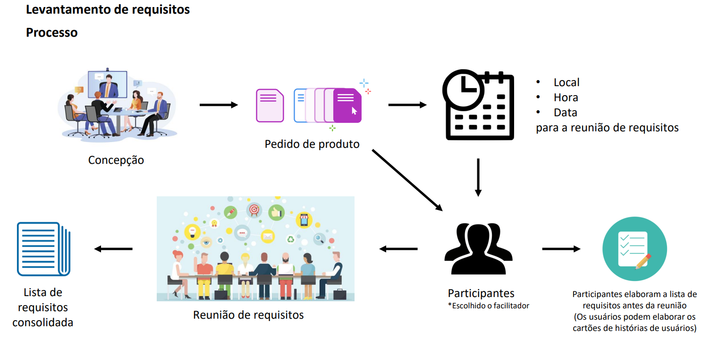

# 📋Levantamento de Requisitos

## Instruções:

O objetivo é identificar o problema, propor elementos da solução, negociar diferentes abordagens e
especificar um conjunto preliminar de requisitos da solução em uma atmosfera que seja propícia para o
cumprimento da meta

## Requisitos funcionais

 ID  | Requisito
-----|----------
RF01 | O usuário deve ser capaz de realizar login
RF02 | O sistema deve exibir conversas e contratos anteriormente analisados
RF03 | O usuário deve ser capaz de criar uma nova conversa sobre contratos
RF04 | Deve-se ser aceito o envio de contratos em PDF, Word, png, jpg, ou qualquer outro formato relevante
RF05 | O aplicativo deve ser capaz de enviar esses arquivos para uma IA especializada
RF06 | A IA deve ser capaz de ler, transcrever, e entender todas as partes de um contrato
RF07 | No chat sobre o contrato, deve ser exibido o relatório da IA
RF08 | O relatório da IA deve conter avaliação geral da coesão, análises de risco
RF09 | O perfil do usuário e suas preferências devem ser levadas em consideração pela IA
RF10 | A IA deve realizar perguntas de múltipla escolha e/ou dissertativas para melhor entendimento do perfil do usuário e contexto do contrato

## Requisitos não funcionais

  ID  | Tópico | Requisito
------|--------| ---------
RNF01 | Segurança | Os arquivos e contratos enviados devem ser mantidos em segurança contra acessos não autorizados
RNF02 | Segurança | Os dados das conversas não devem contaminar a base de dados da IA
RNF03 | Privacidade | O sistema deve garantir a segurança e anonimato dos dados de seus usuários
RNF04 | Usabilidade | O usuário não deve precisar de conhecimentos técnicos para entendimento do relatório da IA

## Usabilidade

## Confiabilidade

## Desempenho

## Facilidade de Suporte

